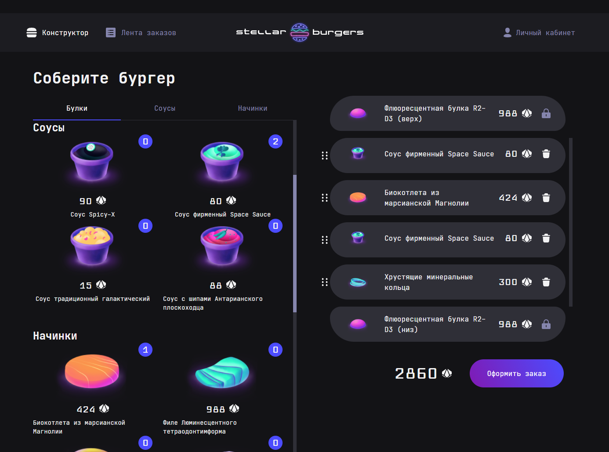

# Учебный проект: Stellar Burger 



## Стек и технологии:


В качестве основной библиотеки UI использовалась **react-developer-burger-ui-components**, которая в себя включает шрифты иконки и основные стили.

Для реализации модальных окон использовалась библиотека **React-Create portal**

Для качественного роутинга в приложении так же используется библиотека **react-router-dom 5**

Для интерактивного взаимодействия с элементами конструктора бургера и его элементов использовалась библиотека **react-dnd**


### Запуск проекта

Клонируйте репозиторий

```
https://github.com/M0riaz/react-stellar-burger.git
```

Установите зависимости

```
npm install
```

Запустите проект

```
npm start
```

Сайт можно посмотреть по данной [ссылке](<https://m0riaz.github.io/react-stellar-burger>)

[Ссылка на макет в Figma](<https://www.figma.com/proto/ocw9a6hNGeAejl4F3G9fp8/React-_-Проектные-задачи-(3-месяца)_external_link?node-id=2973-2131&starting-point-node-id=2973%3A2131>)